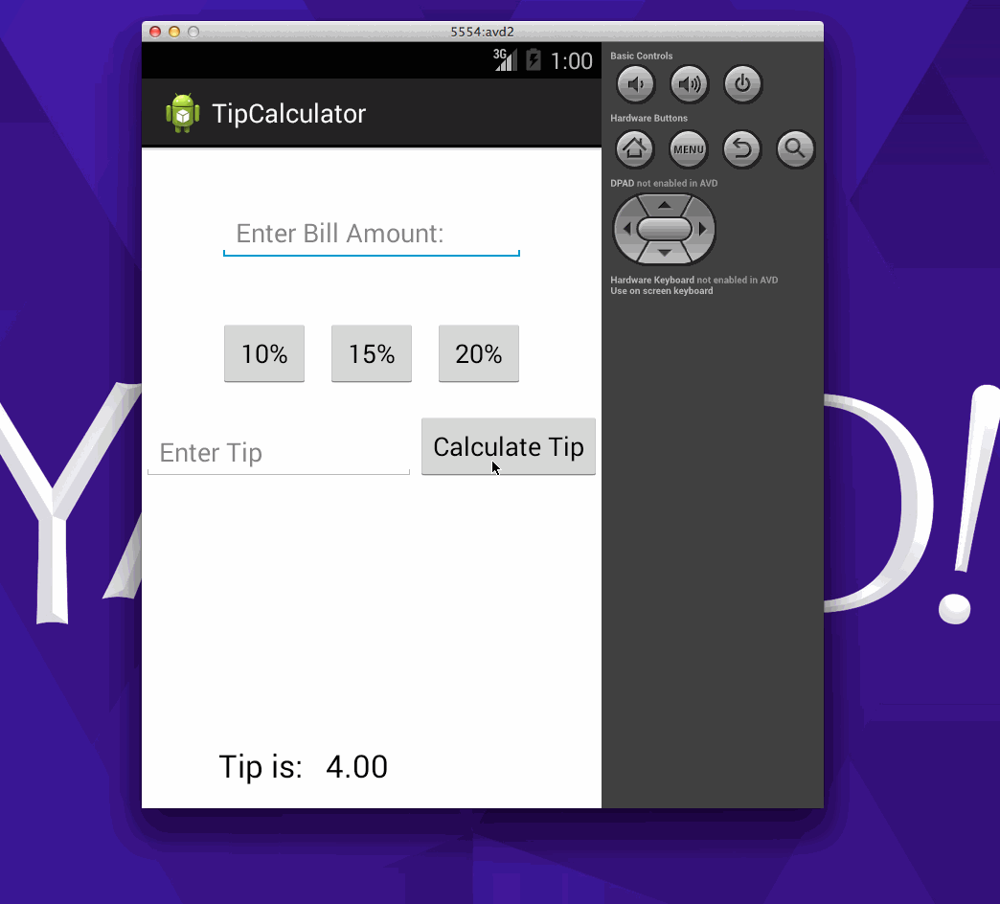

ToDo App Demo

This is an Android demo application for calculating Tip. It allows user to enter the Bill amount and calculate tip for 10%,15%,20% or user can enter the percentage.

Time spent: 2 hours spent in total
Completed user stories:

Required:: User is displayed the tip of specified percentage for specified entered amount

Required:: User enters the total amount of the transaction

Required:: User can select between tip amounts (i.e 10%, 15%, 20%)

Required:: Upon selecting tip amount, formatted tip value is displayed

Optional:: User can select custom tip percentage if desired

Walkthrough of all user stories:
  

